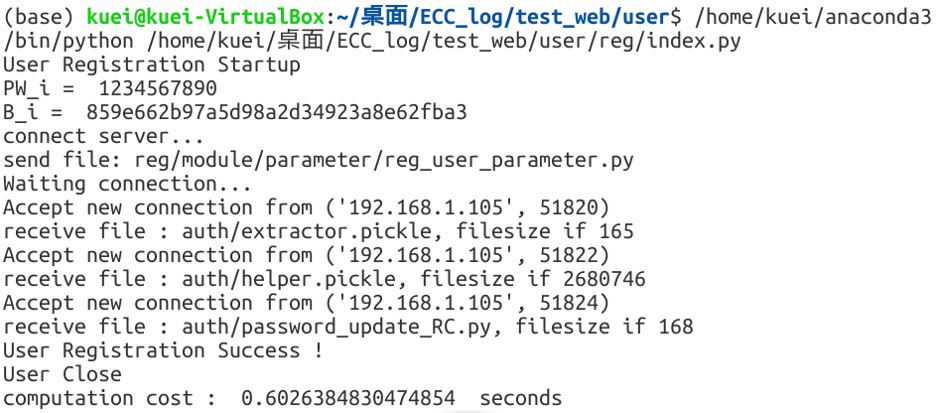
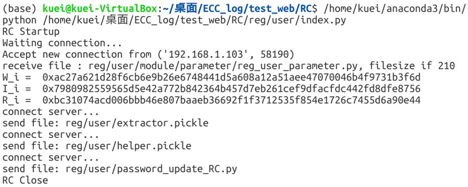
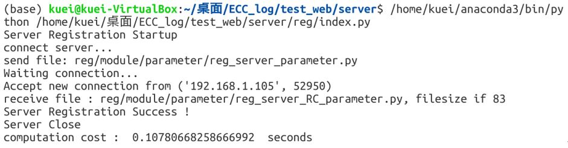
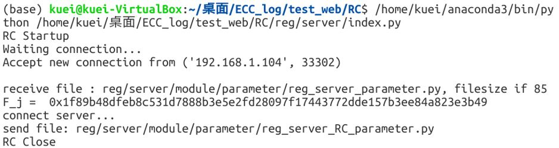
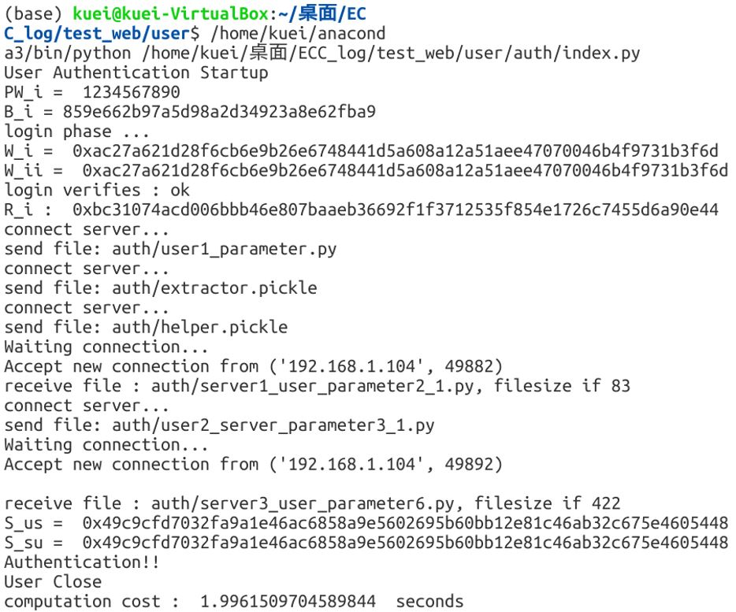
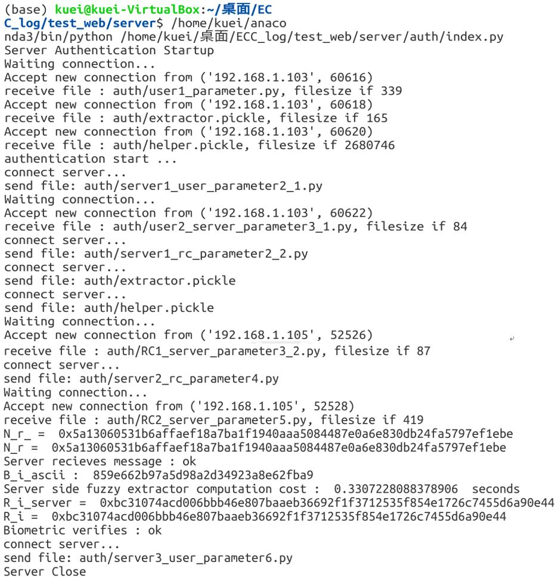
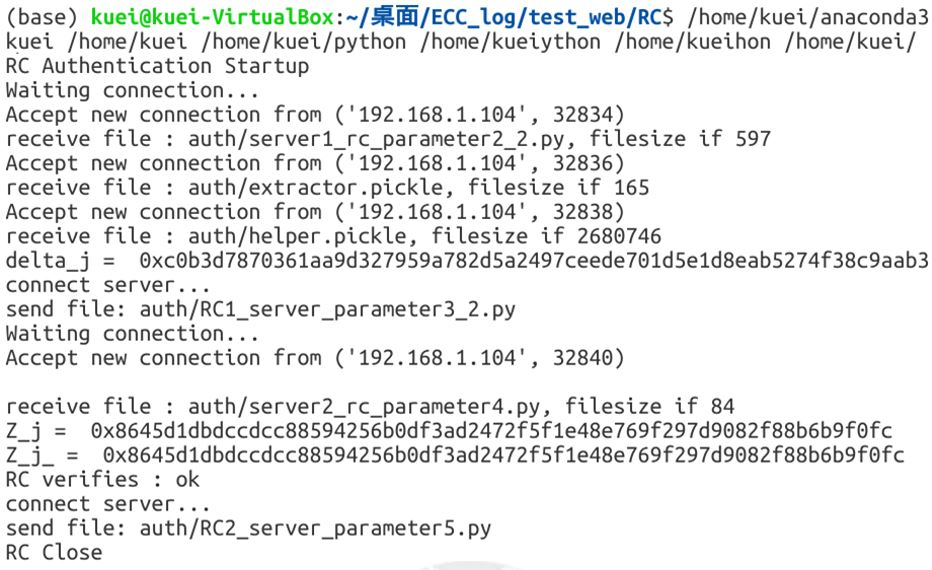
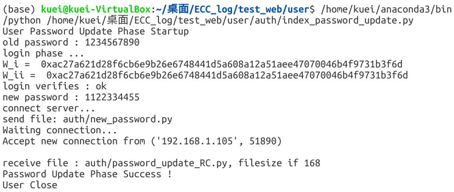
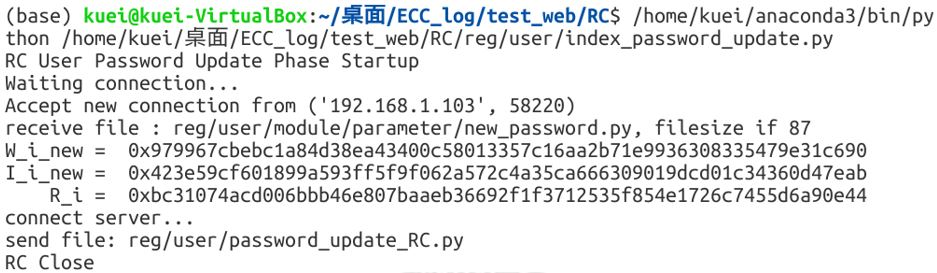

# Paper_implementation
論文實作

期刊：Enhancing Biometric and Mutual Verification in Multi-server Three-factor User Remote Authentication Scheme with Elliptic Curve Cryptography

套件&原始碼：
1. face_recognition 1.2.3： https://pypi.org/project/face_recognition/
2. fuzzy-extractor 0.3：https://pypi.org/project/fuzzy-extractor/
3. Socket：https://pypi.org/project/fuzzy-extractor/
4. ECC：https://blog.csdn.net/luckytanggu/article/details/53491892

環境：
1. 系統：ubuntu16.04
2. VirtualBox 三台規格：
Intel i7-7700 (4 CPUs) 6G RAM, 
Intel i7-7700 (4 CPUs) 6G RAM, 
Intel i7-7700 (4 CPUs) 4G RAM, 
 
實作結果：
### 1. User registration phase

### 2. Server registration phase

### 3. Login and authentication phase

### 4. Password update phase

